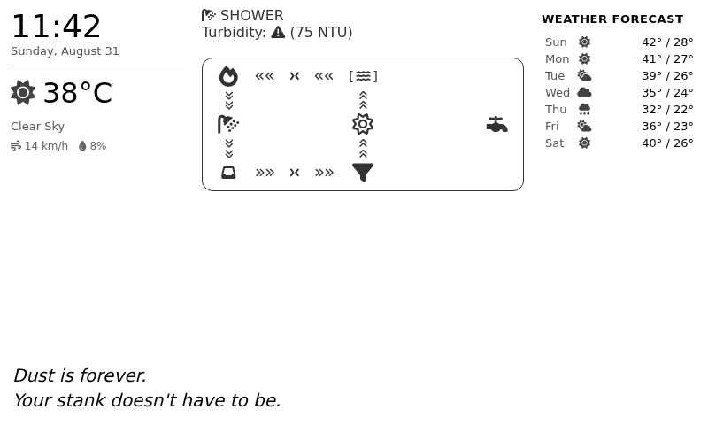
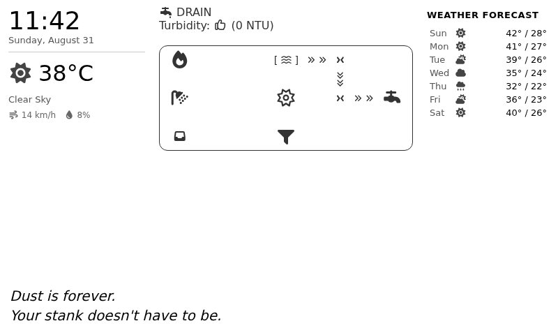
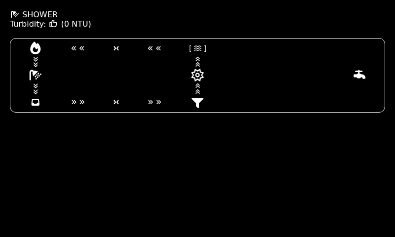
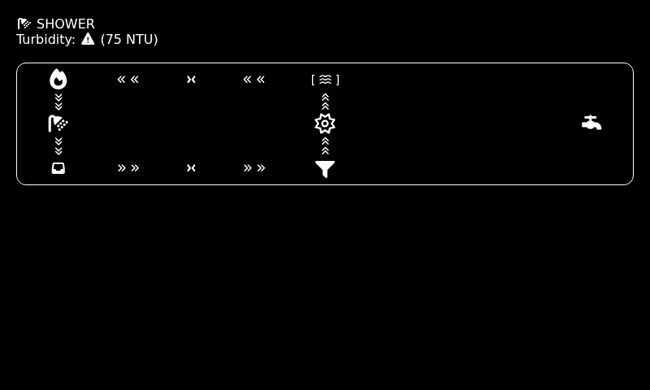
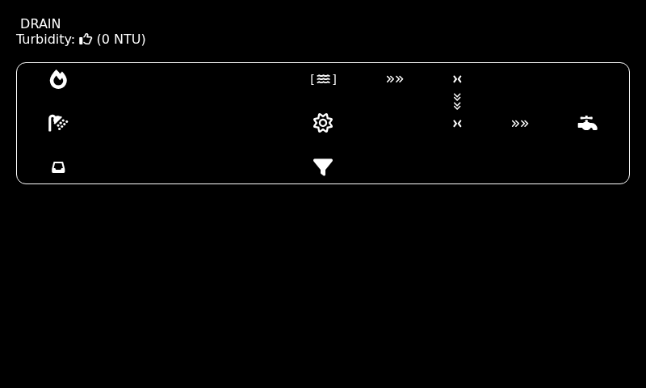
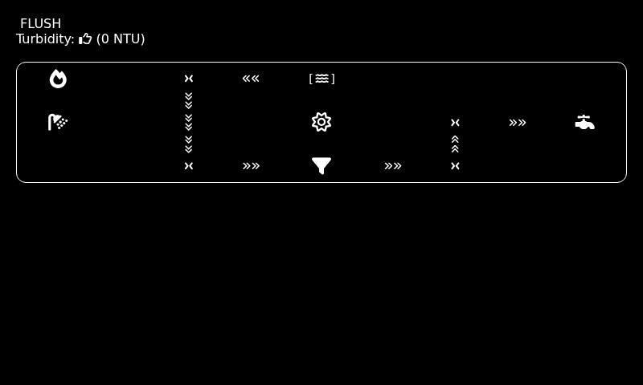
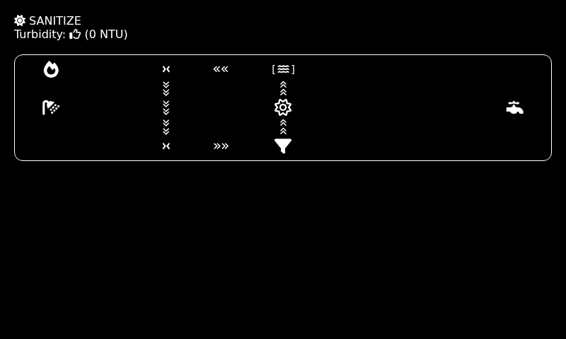

# Infinistream — Usage Guide

This guide covers everything needed to deploy and operate Infinistream at a site.

## Hardware Requirements

### Controller Pi

| Component           | Part                    | Notes                              |
|---------------------|-------------------------|------------------------------------|
| SBC                 | Raspberry Pi (any model)| Runs Python control loop           |
| ADC board           | Waveshare ADS1263 HAT   | SPI — reads sensors and mode switch|
| Relay board         | Devantech ETH008        | Ethernet, fixed IP 192.168.2.3     |
| Flow sensor (drain) | Gredia GR-S403          | Analog 0–5 V, ADC channel 0       |
| Flow sensor (supply)| Gredia GR-S403          | Analog 0–5 V, ADC channel 1       |
| Flow sensor (return)| Gredia GR-S403          | Analog 0–5 V, ADC channel 6       |
| Turbidity sensor    | DFRobot KS0414          | Analog 0–5 V, ADC channel 2       |
| Mode switch         | 3-position rotary       | Digital GPIO, ADC channels 3–5    |

### Display Pi

| Component           | Part                          | Notes                                  |
|---------------------|-------------------------------|----------------------------------------|
| SBC                 | Raspberry Pi 4 (recommended)  | Runs Docker: 3 services                |
| E-ink display       | Waveshare 7.5" e-Paper V2     | SPI — 800×480, ~4 s refresh            |
| Satellite modem     | RockBLOCK 9603                | USB (`/dev/ttyUSB0`)                   |
| GPS receiver        | Waveshare L76K GPS HAT        | UART (`/dev/ttyAMA0`), 9600 baud       |

### Cloud

| Component    | Platform         | Notes                               |
|--------------|------------------|-------------------------------------|
| SBD Gateway  | AWS Lambda       | Function URL (free tier, built-in HTTPS) |
| Weather data | Open-Meteo       | No API key required                 |

---

## Prerequisites

- Docker and Docker Compose installed on the Display Pi
- A Rock7 account with the RockBLOCK 9603 registered
- An AWS account (for the sbd-gateway Lambda)

---

## Step 1 — Deploy the sbd-gateway Lambda

The Lambda receives MO (Mobile Originated) messages from Rock7, fetches weather from
Open-Meteo, and sends an MT (Mobile Terminated) weather payload back to the device.

### Package and deploy

```bash
cd sbd-gateway
npm install
zip -r gateway.zip handler.js src/ node_modules/
```

In the AWS console (or CLI):

1. Create a Lambda function (Node.js 20.x runtime).
2. Upload `gateway.zip`.
3. Set handler to `handler.handler`.
4. Add a **Function URL** (auth type: NONE) — this gives you a permanent HTTPS endpoint.
5. Set environment variables:

| Variable          | Value                          |
|-------------------|--------------------------------|
| `ROCK7_USERNAME`  | Your Rock7 account username    |
| `ROCK7_PASSWORD`  | Your Rock7 account password    |

Copy the Function URL — you'll need it in the next step.

### Configure Rock7 MO webhook

In the Rock7 online portal, set the **Delivery Group** for your RockBLOCK's IMEI to
forward MO messages to your Lambda Function URL. The gateway expects a
`application/x-www-form-urlencoded` POST body with `imei` and `data` fields, which is
exactly what Rock7 sends.

---

## Step 2 — Configure the Display Pi

### Environment variables

Create a `.env` file alongside `docker-compose.yml`:

```bash
# Rock7 credentials (used by sbd-gateway, not the display Pi directly)
# These are only needed if you run the gateway locally for testing.

# Satellite comms intervals
WEATHER_INTERVAL_MS=21600000     # 6 hours between weather updates
TIME_SYNC_INTERVAL_MS=43200000   # 12 hours between time syncs
```

### Device paths

The defaults in `docker-compose.yml` are:

| Device        | Default path    | Purpose                  |
|---------------|-----------------|--------------------------|
| RockBLOCK     | `/dev/ttyUSB0`  | SBD modem (USB serial)   |
| GPS HAT       | `/dev/ttyAMA0`  | NMEA sentences (UART)    |

If your device paths differ, edit the `devices:` section in `docker-compose.yml` for the
`comms-service`.

---

## Step 3 — Start the Display Pi services

```bash
cd /path/to/infinistream
docker compose up -d
```

This starts three services:

| Service          | Port | Purpose                                                    |
|------------------|------|------------------------------------------------------------|
| `magicmirror`    | 8080 | MagicMirror² UI with rockblock weather provider            |
| `eink-service`   | 3001 | Screenshots MagicMirror and pushes image to e-ink panel    |
| `comms-service`  | 3002 | Manages GPS, RockBLOCK, and weather cache                  |

View logs:

```bash
docker compose logs -f comms-service   # satellite comms activity
docker compose logs -f magicmirror     # MM startup and module errors
docker compose logs -f eink-service    # screenshot and render events
```

### Startup sequence

On first boot, `comms-service` will:

1. Open the GPS serial port and wait for a valid GPS fix.
2. Perform an SBD session to sync system time via Iridium (AT-MSSTM).
3. Encode the GPS position as an MO payload and transmit it.
4. The Lambda responds with an MT payload containing 7-day weather.
5. The weather is cached and served at `http://localhost:3002/weather`.
6. MagicMirror's rockblock weather provider polls this endpoint.

Subsequent sessions run on the configured intervals (default: every 6 hours for weather,
every 12 hours for time sync).

---

## Step 4 — Start the Controller Pi

```bash
# On the Controller Pi
pip install spidev RPi.GPIO devantech-eth click pytest pytest-bdd
python -m src.controller
```

The controller reads sensors every loop iteration and POSTs status updates to the Display
Pi's `node_helper.js` webhook on port 8085:

```
POST http://<display-pi-ip>:8085/shower-update
{ "mode": "SHOWER", "turbidity": 12.3 }
```

Configure the display Pi's IP address and update throttle interval in `src/hw_conf.py`:

```python
MAGICMIRROR_WEBHOOK_URL  = "http://<display-pi-ip>:8085/shower-update"
DISPLAY_UPDATE_INTERVAL  = 30   # seconds
```

---

## Operating the System

### Mode selection

Turn the 3-position rotary switch to select the operating mode:

| Position | Mode     | Description                                          |
|----------|----------|------------------------------------------------------|
| 0        | DRAIN    | Empties the tank to waste                            |
| 1        | SHOWER   | Full recirculation — shower normally                 |
| 2        | FLUSH    | Backflushes the filter to waste                      |

SANITIZE mode activates automatically after 12 hours of idle time in SHOWER mode. The
display will show the SANITIZE icon while this cycle runs.

### Reading the display

The e-ink panel refreshes whenever the system state changes (mode switch, turbidity
crossing a threshold). Expect a ~4 second black-flash during each refresh.

The display shows:
- **Current mode** with an icon and name
- **Turbidity** reading in NTU with a colored indicator (clean / warning / unsafe)
- **Flow diagram** showing which valves and pumps are active
- **Weather** — current conditions and 7-day forecast (satellite-fetched)
- **Compliments** — morale support

## Display Screenshots

### Full display (800×480 — as seen on the e-ink panel)

The full display includes the Infinistream module alongside the clock, current
weather, 7-day forecast, and a compliment. Layout matches the Waveshare 7.5" V2
panel at 800×480 px.

| Mode | Screenshot |
|------|------------|
| SHOWER — clean |  |
| SHOWER — warning |  |
| SHOWER — unsafe |  |
| DRAIN |  |
| FLUSH |  |
| SANITIZE |  |
| CONNECTING |  |

### Module only

The Infinistream module in isolation (no surrounding modules).

| Mode | Screenshot |
|------|------------|
| SHOWER — clean |  |
| SHOWER — warning |  |
| SHOWER — unsafe |  |
| DRAIN |  |
| FLUSH |  |
| SANITIZE |  |
| CONNECTING |  |

### comms-service API

The comms-service exposes a simple HTTP API for status inspection:

```
GET http://<display-pi-ip>:3002/weather      # Last received weather payload
GET http://<display-pi-ip>:3002/position     # Last GPS fix (lat, lon, timestamp)
GET http://<display-pi-ip>:3002/time-status  # Last Iridium time sync result
```

---

## Smoke Test

Before deploying to a site, run the smoke test to verify the Docker stack is healthy:

```bash
bash scripts/smoke-test.sh
```

This starts the Docker services, waits for MagicMirror to be ready, sends a test webhook,
and verifies the eink-service receives the trigger. It does not require the RockBLOCK or
GPS hardware.

---

## Troubleshooting

### No weather data on display

1. Check `docker compose logs comms-service` for GPS fix status and SBD session errors.
2. Verify the RockBLOCK is powered (LED solid = registered, blinking = searching).
3. Confirm the Lambda Function URL and Rock7 webhook are configured correctly.
4. Check signal quality: the comms-service requires at least 2/5 bars before attempting
   a session. Ensure the RockBLOCK antenna has a clear view of the sky.

### E-ink not updating

1. Check `docker compose logs eink-service`.
2. Verify the SPI device (`/dev/spidev0.0`) is accessible inside the container.
3. Ensure the display Pi user has SPI permissions (`sudo usermod -aG spi $USER`).

### MagicMirror shows wrong time

The system syncs time from the Iridium network on startup and every 12 hours. If the time
is wrong immediately after boot, check that the GPS fix was acquired before the SBD
session (the scheduler waits for a fix before starting).
